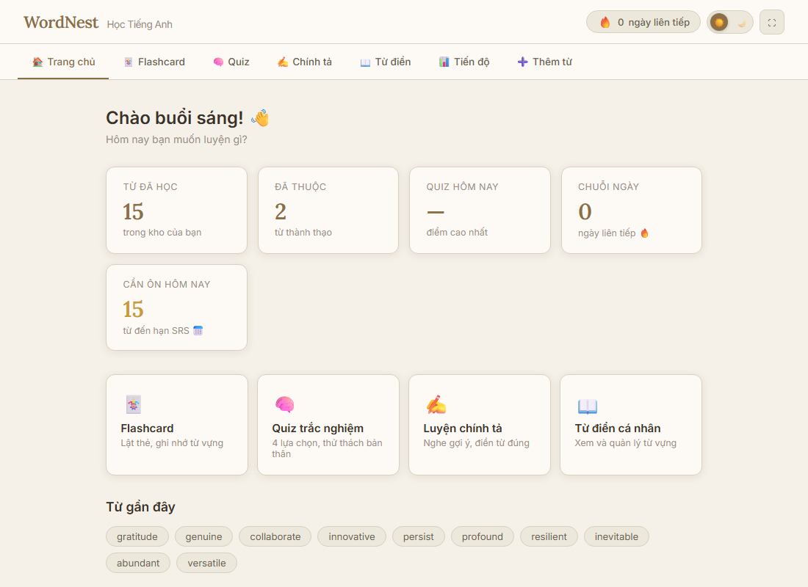
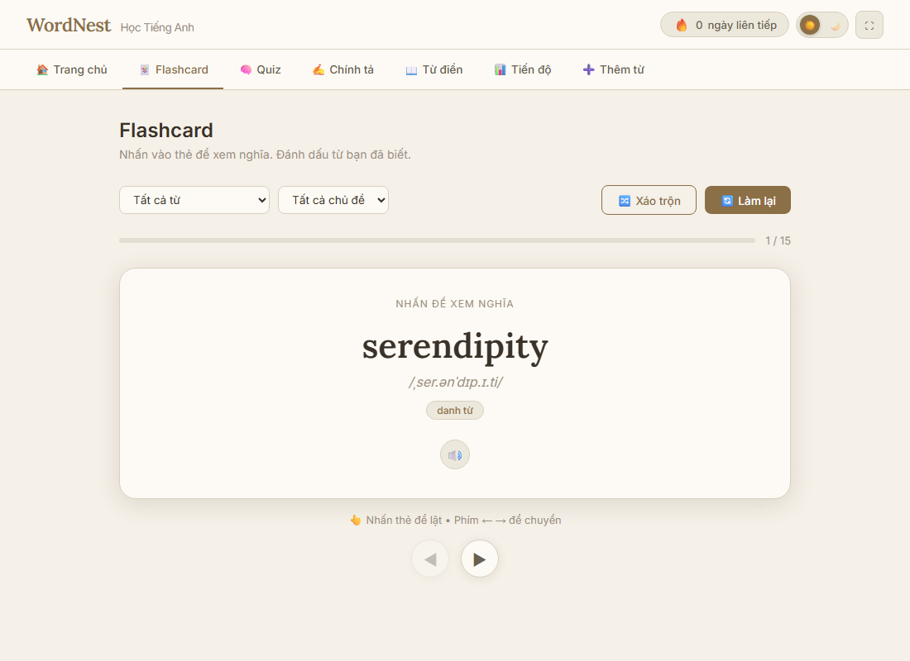
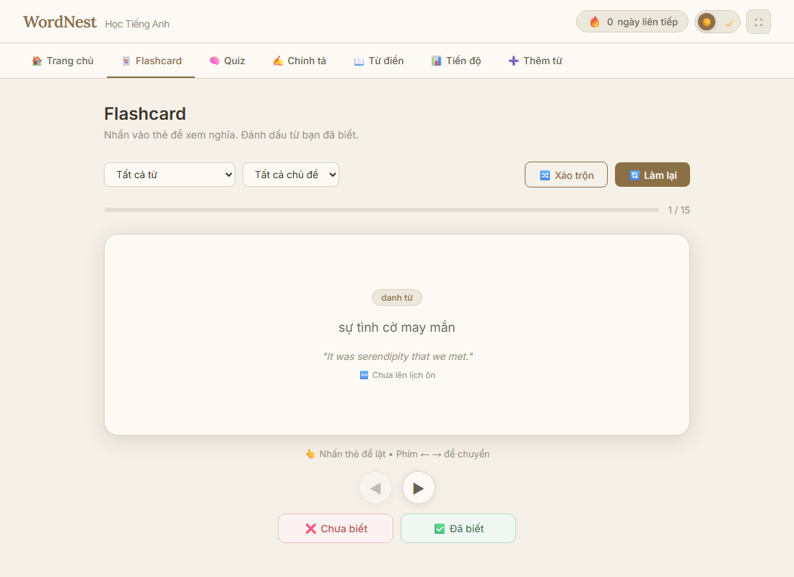
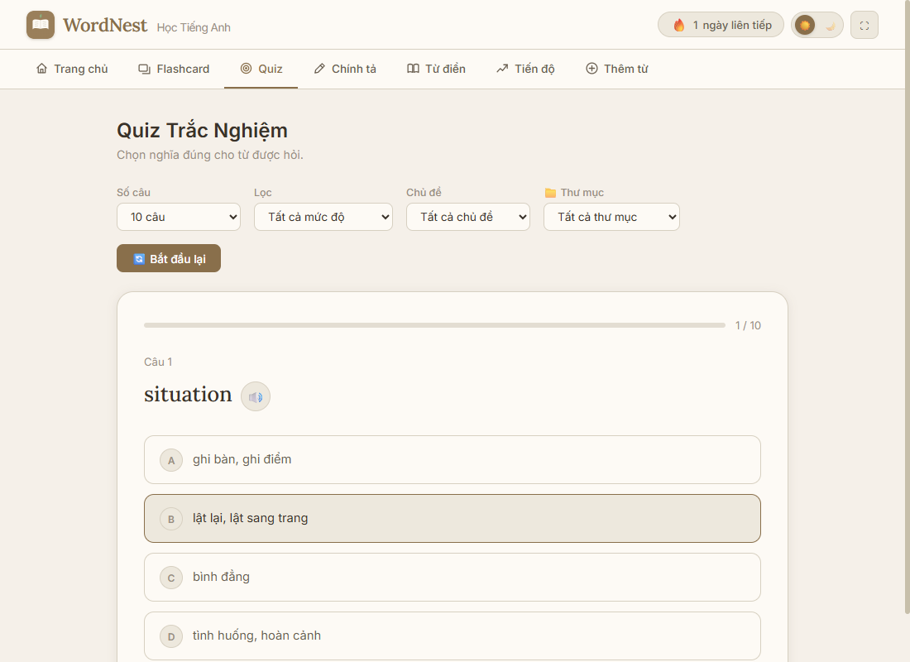
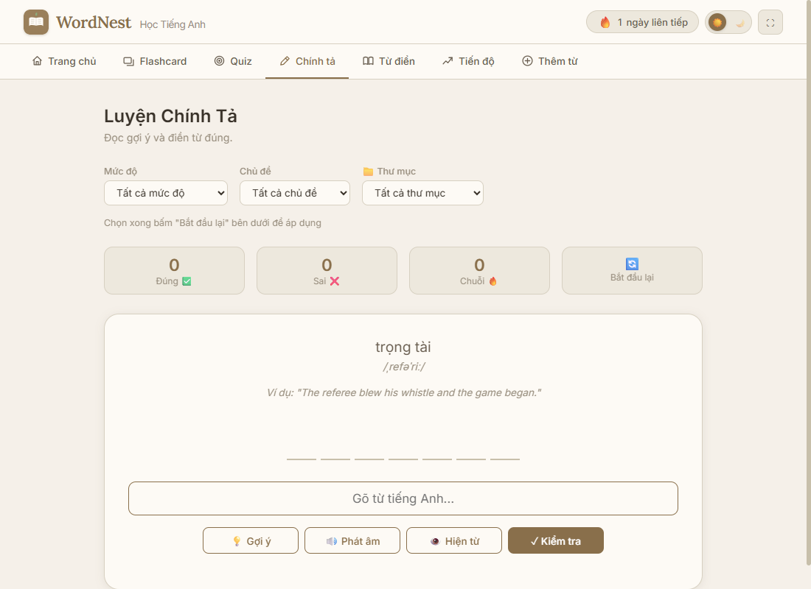
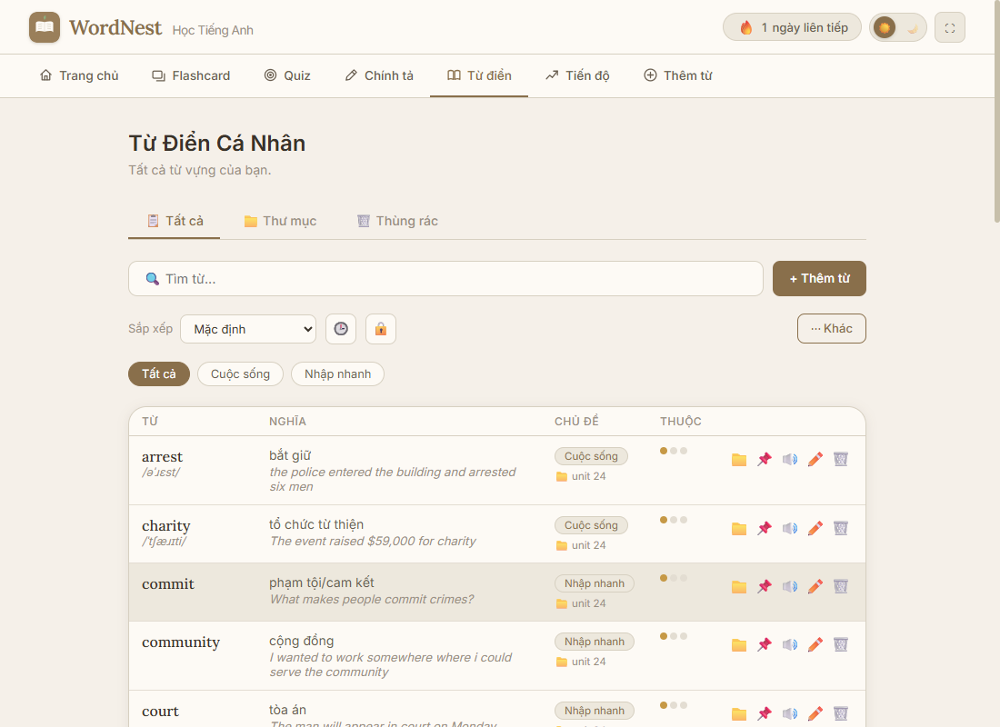
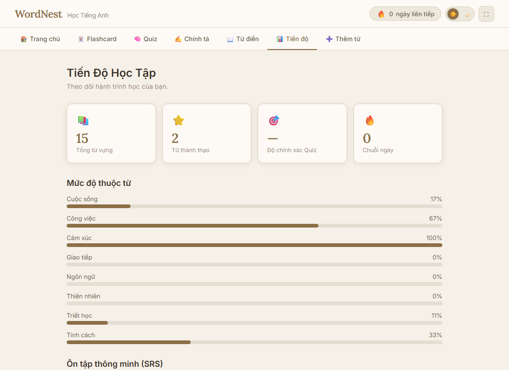
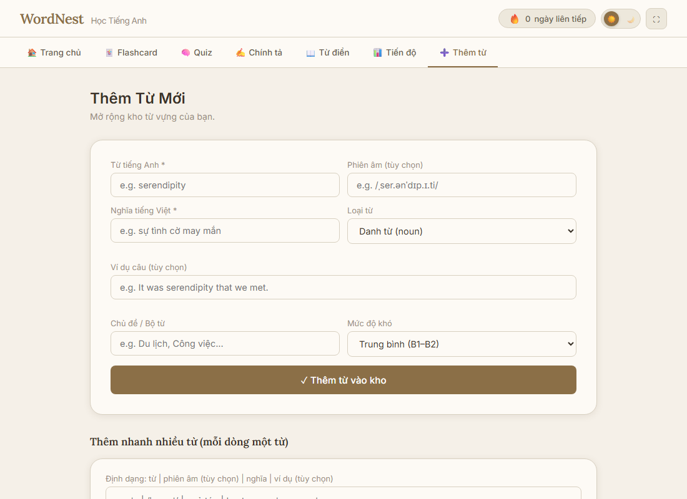
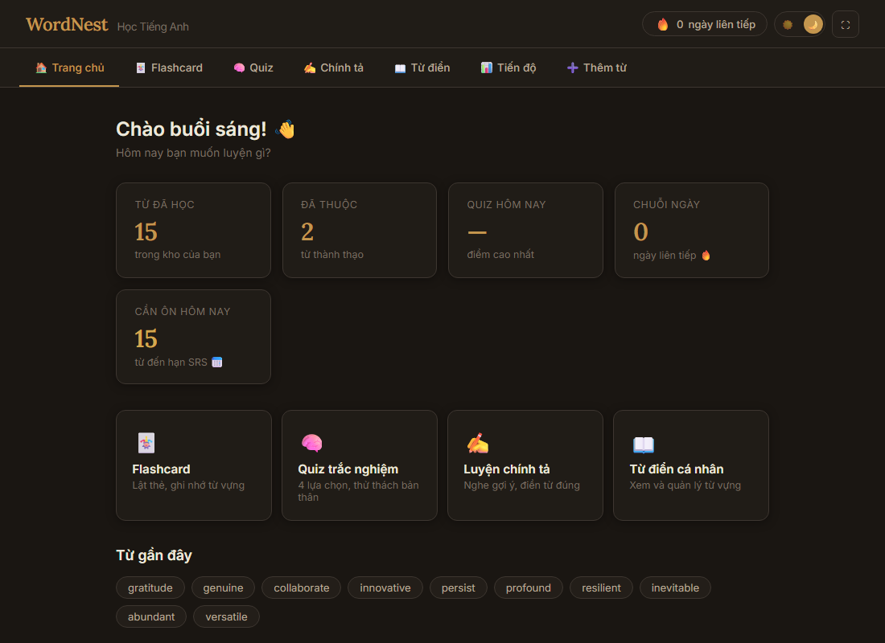

# WordNest — Học Tiếng Anh

App học từ vựng tiếng Anh cá nhân: Flashcard (SRS kiểu SM-2), Quiz trắc nghiệm, Luyện chính tả, Từ điển cá nhân, theo dõi tiến độ (heatmap kiểu GitHub).

## 📥 Tải app desktop

| Hệ điều hành | Tải về |
|---|---|
| Windows | [WordNest-Setup-1.0.11.exe](https://github.com/ngphatdat1311/WORDNEST/releases/download/v1.0.11/WordNest-Setup-1.0.11.exe) |
| macOS (Intel & Apple Silicon) | [WordNest-1.0.11-universal.dmg](https://github.com/ngphatdat1311/WORDNEST/releases/download/v1.0.11/WordNest-1.0.11-universal.dmg) |

Xem tất cả bản phát hành tại [Releases](https://github.com/ngphatdat1311/WORDNEST/releases).

App chưa có chữ ký số (tốn phí, không cần thiết cho dùng cá nhân) nên lần đầu mở:
- **Windows:** SmartScreen báo "Unknown publisher" → bấm **More info → Run anyway**.
- **macOS:** Gatekeeper báo "không xác định được nhà phát triển" → chuột phải (hoặc Control-click) vào app → **Open**.

Từ các bản sau, app sẽ tự báo trong giao diện khi có bản mới hơn — không cần gỡ cài đặt rồi tải lại (xem mục [Cập nhật app](#-cập-nhật-app)).

## 📖 Hướng dẫn sử dụng

### Trang chủ



Tổng quan nhanh: số từ đã học, số từ đã thuộc, điểm Quiz cao nhất, chuỗi ngày học liên tiếp 🔥, và số từ **đến hạn ôn tập** theo lịch SRS. Bấm vào 1 trong 4 ô lớn phía dưới để vào thẳng chế độ học tương ứng. "Từ gần đây" hiện các từ bạn mới xem — bấm vào để nghe phát âm.

### Flashcard (SRS)




Nhấn vào thẻ (hoặc phím **Space/Enter**) để lật xem nghĩa, dùng phím **← →** để chuyển thẻ. Sau khi lật, đánh dấu **Đã biết** / **Chưa biết** — app dùng thuật toán SM-2 để tự tính ngày ôn lại tối ưu (thẻ trả lời đúng sẽ giãn cách ra xa hơn, sai thì hôm sau gặp lại ngay). Lọc theo "Chưa thuộc / Cần ôn tập / Đến hạn ôn (SRS)" và theo chủ đề ở 2 ô dropdown phía trên; nút **Xáo trộn** để học không theo thứ tự cũ.

### Quiz trắc nghiệm



Chọn số câu và lọc theo mức độ/chủ đề/thư mục, mỗi câu 4 lựa chọn nghĩa. Trả lời sai sẽ hiện ngay đáp án đúng + ví dụ. Cuối bài có danh sách các từ bạn trả lời sai để ôn lại. Tiến trình quiz được giữ tạm nếu lỡ refresh trang giữa bài.

### Luyện chính tả



Đọc nghĩa + nghe gợi ý phát âm, gõ đúng từ tiếng Anh. Mỗi ô vuông là 1 ký tự; cụm từ nhiều tiếng (vd "give up") sẽ hiện khoảng cách rõ ràng giữa các tiếng. Có nút **Gợi ý** (hiện dần từng ký tự) và **Hiện từ** (bỏ qua, tính là sai). Lọc theo **mức độ khó**, **chủ đề** và **thư mục** — chọn xong bấm "Bắt đầu lại" để áp dụng. Trả lời đúng hay sai đều được tính là một lượt học (ghi nhận vào streak/heatmap).

### Từ điển cá nhân



Xem toàn bộ từ vựng, tìm kiếm, lọc theo chủ đề, sắp xếp theo A-Z/độ thuộc/mới xem. Mỗi từ có nút: 📌 *tạm ẩn khỏi ôn tập* (đánh dấu "đã thuộc hẳn"), 🔊 phát âm, ✏️ sửa, 🗑️ xóa. Khi **sửa từ**, hiện toast "Hoàn tác" trong 5 giây để khôi phục lại nếu lỡ tay.

Menu **⋯ Khác** cung cấp nhiều tùy chọn:
- **Xuất JSON** — sao lưu toàn bộ (kèm thư mục, thùng rác)
- **Xuất CSV** — mở bằng Excel, Google Sheets
- **Xuất Anki** — nhập thẳng vào Anki (file `.txt` tab-separated, có card front/back định dạng HTML)
- **Nhập JSON** — khôi phục/đồng bộ thủ công từ file sao lưu
- **Xóa tất cả** — toàn bộ từ điển vào Thùng rác (có hộp xác nhận)

### Tiến độ học tập



- **Thống kê tổng quan**: tổng từ, số từ thành thạo, độ chính xác Quiz, chuỗi ngày học
- **Thống kê Quiz**: số phiên chơi, tổng câu hỏi, độ chính xác trung bình, kỷ lục cao nhất
- **Phân bổ từ vựng**: biểu đồ theo mức độ khó (A1–A2 / B1–B2 / C1–C2) và theo loại từ (danh từ, động từ...)
- **Từ cần ôn thêm**: danh sách các từ bạn xem nhiều nhất nhưng vẫn chưa thuộc (tỷ lệ sai cao)
- **Mức độ thuộc từng chủ đề**: thanh tiến trình theo từng bộ từ
- **Lịch ôn SRS**: số từ đến hạn hôm nay, đã lên lịch, chưa ôn lần nào
- **Heatmap hoạt động cả năm** kiểu GitHub — màu đậm hơn nghĩa là học nhiều hơn trong ngày đó
- **Đồng bộ tự động ☁️**: chọn thư mục OneDrive/Google Drive/Dropbox để tự động lưu snapshot sau mỗi thay đổi

### Thêm từ mới



Gõ từ tiếng Anh, app **tự tra từ điển + dịch nghĩa** (phiên âm, loại từ, ví dụ, chủ đề gợi ý) sau khoảng nửa giây — bạn chỉ cần kiểm tra lại và bấm Thêm. Khi không tra được từ qua nguồn chính, app tự thử thêm 2 nguồn dự phòng (dịch trực tiếp + phiên âm Datamuse) nên tỷ lệ tra ra nghĩa cao hơn, kể cả với từ hiếm/tiếng lóng. Nếu gõ **nguyên một câu** (≥6 từ, hoặc kết thúc bằng `.`/`!`/`?`), app nhận biết và dịch thẳng cả câu đó sang tiếng Việt thay vì tra từ điển.

Ví dụ câu tự động lấy từ kho câu thật **Tatoeba** (hàng chục câu mỗi từ, có sẵn bản dịch cho rất nhiều câu) — bấm **🔄 Đổi ví dụ khác** để xem câu khác, không lặp lại câu đã xem cho tới khi hết hẳn.

Phía dưới có khung **Thêm hàng loạt nhiều từ cùng lúc**, mỗi dòng theo định dạng:

```
từ | phiên âm (tùy chọn) | nghĩa | ví dụ (tùy chọn)
```

Từ có khoảng trắng (vd `give up`, `be fond of ...`) sẽ tự được nhận là **cụm từ** thay vì từ đơn. Vẫn dùng được định dạng cũ không có phiên âm (`từ | nghĩa | ví dụ`).

### Thư mục & Thùng rác

Tổ chức từ vựng vào **thư mục** tùy chỉnh (vd "IELTS Writing", "Công việc"), quản lý qua tab **Thư mục** trong header. Từ/thư mục đã xóa vào **Thùng rác** — có thể khôi phục lại bất cứ lúc nào, hoặc xóa vĩnh viễn.

### Giao diện sáng / tối



Bấm nút ☀️/🌙 trên góc phải header để đổi giao diện — lựa chọn được nhớ lại cho lần mở sau.

## ☁️ Đồng bộ tự động

Chọn một thư mục trong **OneDrive / Google Drive / Dropbox** (hoặc bất kỳ thư mục chia sẻ nào), app sẽ tự động lưu snapshot toàn bộ dữ liệu vào file `wordnest-sync.json` sau mỗi lần thêm/sửa/xóa từ.

Khi mở app trên máy khác (đã đồng bộ cùng thư mục cloud), app tự phát hiện file sync mới hơn dữ liệu cục bộ và hiện banner hỏi có muốn khôi phục không.

Cài đặt tại tab **Tiến Độ → Đồng bộ tự động ☁️**.

## 🔄 Cập nhật app

App tự kiểm tra phiên bản mới mỗi khi mở (không tự tải gì nếu bạn chưa đồng ý). Có bản mới sẽ hiện banner ở trên cùng — bấm **"⬇️ Cập nhật ngay"**, app tự tải và khởi động lại để áp dụng, dữ liệu của bạn không bị mất.

> **macOS** cần app được ký bằng chứng chỉ Apple (trả phí) mới auto-update đầy đủ được. Hiện tại bản Mac **chưa có chữ ký số**, nên người dùng Mac vẫn cần tải bản `.dmg` mới thủ công từ [Releases](https://github.com/ngphatdat1311/WORDNEST/releases) khi có bản cập nhật — Windows thì auto-update hoạt động đầy đủ.

## 🧩 Tiện ích Chrome — bôi đen từ trên web khác, gửi thẳng vào app

Cài riêng theo hướng dẫn trong [extension/README.md](extension/README.md). Khi app desktop đang mở, bôi đen 1 từ tiếng Anh trên bất kỳ trang web nào → bấm nút nhỏ hiện lên (hoặc chuột phải) → từ đó vào ngay hộp thư "Thêm từ" trong app. Nếu app đang tắt lúc bôi đen, từ sẽ tự vào app ngay khi bạn mở lại.

## Cấu trúc dự án

```
index.html         Markup chính (dùng chung cho app desktop)
css/               Giao diện (sáng/tối, responsive) + font tự host
js/
  storage.js       Lưu trữ dữ liệu (file-based trong Electron, localStorage fallback)
  sync.js          Đồng bộ tự động vào thư mục cloud
  flashcard.js     Chế độ Flashcard + SRS
  quiz.js          Quiz trắc nghiệm
  spelling.js      Luyện chính tả
  wordlist.js      Từ điển cá nhân
  progress.js      Thống kê tiến độ + heatmap
  lookup.js            Điều phối tra từ điển + dịch tự động (UI wiring)
  lookup-cache.js      Cache kết quả tra từ điển
  lookup-classify.js   Đoán từ loại / độ khó CEFR / chủ đề
  lookup-providers.js  Gọi API dịch + dictionaryapi.dev, parse kết quả
  export-import.js Xuất JSON / CSV / Anki, Nhập JSON
  word-crud.js     Thêm/sửa/xóa từ + undo
  folders.js       Quản lý thư mục
  trash.js         Thùng rác
  backup.js        Nhắc nhở sao lưu định kỳ
  streak.js        Streak + heatmap hoạt động + SRS
  event-wiring.js  Nối các nút/tab tĩnh tới hàm xử lý (addEventListener)
electron/
  main.js          Main process: cửa sổ, IPC handlers, auto-update, bridge server
  preload.js       IPC bridge an toàn (contextBridge)
extension/         Tiện ích Chrome "WordNest Capture"
tests/             Unit test (node:test) cho logic thuần: SRS, streak, sync, lookup
.github/workflows/ CI tự build .exe/.dmg + kèm metadata cập nhật mỗi khi đẩy tag vX.Y.Z
```

## Tự build từ source

```
npm install
npm start        # chạy thử ở chế độ dev
npm test         # chạy unit test
npm run lint     # kiểm tra lỗi/style bằng ESLint
npm run dist     # build installer cho hệ điều hành hiện tại, ra trong dist/
```

Bản macOS chỉ build được trên máy Mac (hoặc qua CI) — xem `.github/workflows/build.yml`.

## Lưu ý

- **Dữ liệu** lưu trong thư mục userData của app (không giới hạn kích thước, khác localStorage). Dùng tính năng **Đồng bộ ☁️** hoặc nút **Xuất JSON** để sao lưu định kỳ.
- Khi chạy lần đầu sau khi nâng cấp, app tự động di chuyển dữ liệu cũ (nếu có trong localStorage) sang file mới — không cần làm gì thêm.
